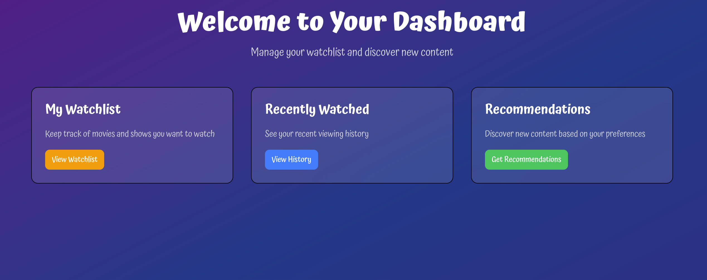
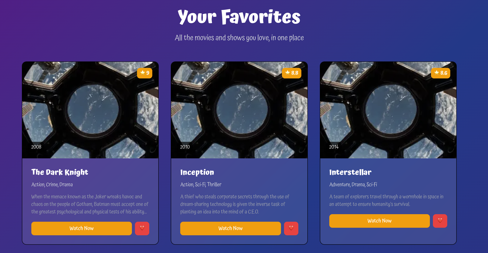
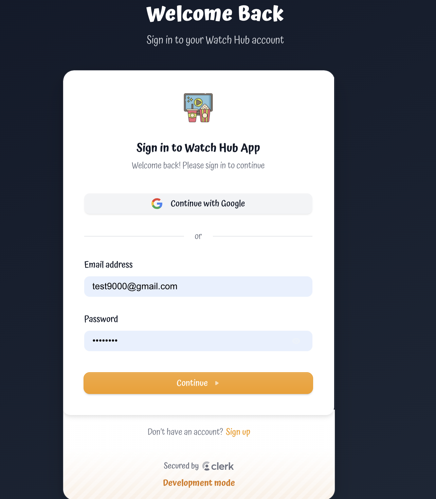

# 🎬 Watch Hub App

### Your Ultimate Entertainment Hub!

Watch Hub is a modern, full-stack entertainment discovery app built with Next.js 15, featuring authentication, dark mode, and a beautiful user interface. Discover movies, manage your watchlist, and enjoy a seamless viewing experience.

### 🎥 Key Features Showcase

- **🔐 Authentication Flow**: Secure sign-in and registration
- **🎬 Movie Discovery**: Browse and discover entertainment content
- **⭐ Favorites Management**: Save and organize your watchlist
- **📱 Responsive Design**: Perfect on all devices

### 🚀 Live Demo

Experience the app live at: []()

## ✨ Features

- 🔐 **Authentication**: Secure login and registration with Clerk
  detection
- 📱 **Responsive Design**: Works perfectly on all devices
- 🎬 **Movie Discovery**: Browse and discover entertainment content
- ⭐ **Favorites**: Save your favorite movies and shows
- 🔔 **Toast Notifications**: Smooth user feedback
- 🎨 **Modern UI**: Clean, professional design with Tailwind CSS

## 📱 Screenshots

### Home Page


_Beautiful landing page with modern design_

### Dashboard


_User dashboard with personalized content_

### Favorites


_Favorites page with movie cards and statistics_

### Authentication


_Secure authentication flow_

## 🛠️ Tech Stack

- **Next.js 15** - Latest React framework with App Router
- **React 19** - Latest React with concurrent features
- **Tailwind CSS 4** - Modern utility-first CSS framework
- **Clerk** - Authentication and user management
- **Next Themes** - Theme switching functionality
- **React Icons** - Beautiful icon library
- **React Toastify** - Toast notifications
- **pnpm** - Fast, efficient package manager

## 📁 Project Structure

```
src/
├── app/                           # Next.js App Router
│   ├── (auth)/                   # Route groups
│   │   ├── signin/[[...rest]]/page.js
│   │   └── signup/[[...rest]]/page.js
│   ├── about/page.js
│   ├── dashboard/page.js
│   ├── favorites/page.js
│   ├── globals.css
│   ├── layout.js
│   ├── not-found.jsx
│   └── page.js
├── components/                    # React components
│   ├── ui/                       # Reusable UI components
│   │   ├── Button.jsx
│   │   ├── Card.jsx
│   │   └── index.js
│   ├── common/                   # Common components
│   │   ├── MovieCard.jsx
│   │   ├── StatsCard.jsx
│   │   └── index.js
│   ├── providers/                # Context providers
│   │   └── ClerkThemeProvider.jsx
│   └── Navbar.jsx
├── config/                       # Configuration files
│   └── constants.js              # App constants & routes
├── constants/                    # Static data
│   └── movies.js                 # Movie data
├── utils/                        # Utility functions
│   ├── validation.js             # Validation utilities
│   └── index.js
└── middleware.js                 # Next.js middleware (root level)
```

### 📂 Directory Structure Explained

- **`app/`** - Next.js App Router pages and layouts
- **`components/`** - Reusable React components organized by type
  - **`ui/`** - Reusable UI components (Button, Card)
  - **`common/`** - Common components (MovieCard, StatsCard)
  - **`providers/`** - Context providers (ClerkThemeProvider)
- **`config/`** - Application configuration and constants
- **`constants/`** - Static data and mock data
- **`utils/`** - Utility functions (validation, formatting)
- **`middleware.js`** - Next.js middleware for authentication

## 🚀 Getting Started

### Installation

1. **Clone the repository**

   ```bash
   git clone <repository-url>
   cd watch-hub-app
   ```

2. **Install dependencies**

   ```bash
   pnpm install
   ```

3. **Set up environment variables**

   ```bash
   cp .env.example .env.local
   ```

   Add your Clerk keys to `.env.local`

4. **Run the development server**

   ```bash
   pnpm dev
   ```

5. **Open your browser**
   Navigate to [http://localhost:3001](http://localhost:3001)

## 📜 Available Scripts

- `pnpm dev` - Start development server
- `pnpm build` - Build for production
- `pnpm start` - Start production server
- `pnpm lint` - Run ESLint
- `pnpm clean` - Clean build cache and node_modules
- `pnpm clean:cache` - Clean only build cache

## 🎨 Features in Detail

### Authentication

- Secure user registration and login
- Protected routes with middleware
- User profile management

### Responsive Design

- Mobile-first approach
- Tablet and desktop optimized
- Touch-friendly interactions

## 🔧 Configuration

### Clerk Setup

1. Create a Clerk account at [clerk.com](https://clerk.com)
2. Create a new application
3. Copy your keys to `.env.local`

### Environment Variables

```env
NEXT_PUBLIC_CLERK_PUBLISHABLE_KEY=your_publishable_key
CLERK_SECRET_KEY=your_secret_key
```

## 🚀 Deployment

### Vercel (Recommended)

1. Push your code to GitHub
2. Connect your repository to Vercel
3. Add environment variables
4. Deploy!

### Other Platforms

- Netlify
- Railway
- DigitalOcean App Platform

## 🙏 Acknowledgments

- [Next.js](https://nextjs.org/) for the amazing framework
- [Clerk](https://clerk.com/) for authentication
- [Tailwind CSS](https://tailwindcss.com/) for styling
- [React Icons](https://react-icons.github.io/react-icons/) for icons
